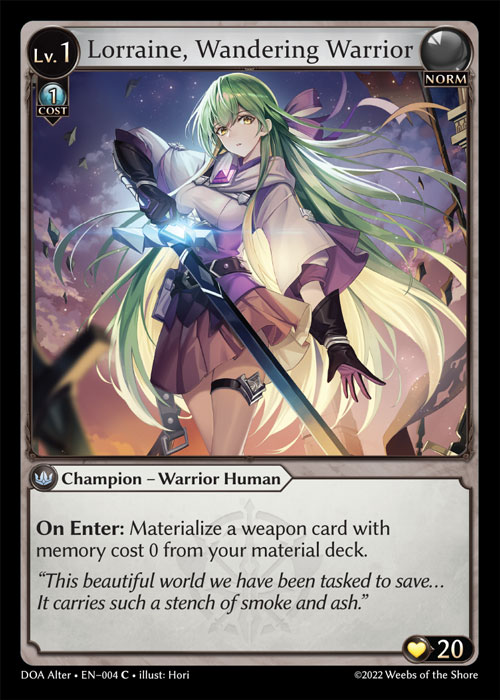

# 通用规则 - 游戏开始

步骤 1：每位玩家将自己的素材库和主牌库放置在对应的区域

步骤 2：每位玩家洗切自己的主牌库以确保其被充分随机化

步骤 3：玩家们将自己的主牌库交给对手来进行洗切和/或切牌

步骤 4：玩家们决定先手玩家。这可以通过所有玩家都同意的任意随机方式来进行

步骤 5：按回合顺序，玩家们执行任何游戏前行动。



例如，像 The Looking Glass 这样的卡牌具有允许玩家在游戏开始时就将其放置在战场上的能力。在一位玩家将要进行其第一回合之前，他们将被允许确认该能力，作为一个特殊游戏行动将此牌放置在战场上。当游戏开始时，此牌将被视作在第一回合前就已在场。


步骤 6：先手玩家开始其第一回合。

### 第一回合

每位玩家的第一个回合都遵循一个经过修改的回合顺序，回合玩家会跳过其唤醒、具预和追忆阶段，并从素材库将一个0级英雄放置在战场上。

在一场双人游戏中，先手玩家还会跳过其抽牌阶段。
