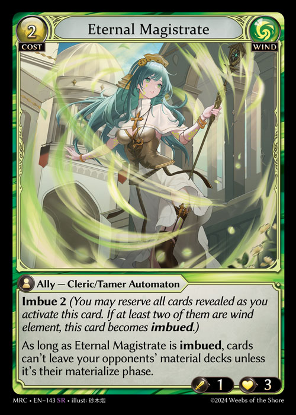

# 打出卡牌 - 卡牌启动

在启动一张卡牌时，玩家从该牌当前所在的区域中拿取该牌，将其置于效果堆叠上，并支付其相关的启动代价。一张卡牌的启动按顺序具有以下步骤：宣告启动、检查属性、宣告代价、选择模式、宣告目标、检查合规性、计算封存代价、支付代价以及完成启动。

1. 宣告启动：首先，玩家宣告他们正在启动的卡牌，并将其置于效果堆叠上。
2. 检查属性：然后，游戏会检查该玩家是否已启用启动该牌所需的属性。如果没有，则该次启动不合规。
   1. 对于其标识是两种或更多属性组合的卡牌（例如，常规和崇高），所有这些属性都必须已被启用。
3. 宣告代价：接下来，玩家宣告该卡牌的目标代价参数。
   1. 如果一张卡牌的代价中具有 X，玩家必须宣告 X 的值。
   2. 如果该牌具有可选代价，玩家必须宣告他们将要支付的所有额外代价。
   3. 如果该牌具有替代代价，他们必须宣告是否要支付该替代代价。如果存在多个替代代价，玩家可以从中选择要支付哪一个。
   4. 如果一张卡牌使用“至多\[X]个目标\[物件]”的措辞，这些目标必须在目标选择期间被指定。


Innervate Fury 不能选择 8 个伙伴来分摊伤害，并选择其中一个目标伙伴受到 0 点伤害。这实际上意味着，最多只能有7个目标来分摊伤害。



4. 选择模式：一些卡牌在启动并被置于效果堆叠上时，要求从给定的选项中选择一个或多个模式。所有模式都必须在该卡牌被置于效果堆叠上时被选择，且在卡牌启动后，已选择的模式不能被更改。
   1. 如果在启动时，有任何模式是基于已解锁的职业奖励而被选择的，那么除非该职业奖励已失去，否则这些模式仍将被选择并保持不变。如果职业奖励已失去，它们不会被静态地重新获得。
5. 宣告目标：在选择模式后，必须为成功的启动选择任何必要的目标。一个目标只有在合规的情况下才能被选择。如果一个效果指示玩家选择“至多”、“任意数量”或其任何变体，则这些目标是可选的；它们并非成功启动该卡牌所必需的。
6. 检查合规性：然后，游戏会为卡牌启动执行一次合规性检查，如果该次启动的任何部分不合规，则该次启动被取消，且游戏将回滚至该卡牌启动被宣告前的那个时间点。不会有任何行动被视为已被做出，也不会产生任何事件触发。
7. 计算封存代价：接下来，玩家通过以下步骤计算卡牌的封存代价：
   1. 首先，确定卡牌的起始封存代价。
   2. 其次，应用设定封存代价的效果。
   3. 再次，同时应用增加或减少封存代价的效果。
   4. 最后，应用移除封存代价的效果。这会使封存代价变为 0。效果不能使封存代价低于 0。
8. 支付代价：接下来，玩家支付卡牌的封存代价以及任何额外或替代代价。如果无法支付代价，则该次启动不合规，且游戏状态会逆转至启动被发起之前。只要所有代价都被满足，它们可以按任意顺序进行支付。
   1. 代价可以通过替代效果来支付。
   2. 如果支付代价导致任何修正或额外模式被加入一次启动中，则对于任何新的未选择模式或选项，将重复步骤 4。对于步骤 5 和 6 也是如此，但是，步骤 7 将不会被重复。在此步骤中未被修正或添加的、先前已选择的目标和模式不能被更改。


例如，对于 8.a, Cordelia 给予你的衍生物“可封存”能力。你将能够在为 Overlord 支付额外代价而牺牲 Powercell 衍生物之前，先将四个 Powercell 衍生物置为待命来支付其封存代价。

.png>).png>)


9. 完成启动：然后，该卡牌被视为已启动，启动该牌的玩家获得时机。

除非另有说明，否则卡牌只能从手牌启动。

因已被启动而进入效果堆叠的卡牌，在它位于效果堆叠上时，该牌本身被视为一次“启动”。

一些效果会指定你可以用回忆代价来启动一张卡牌，而非具现它。

启动一张卡牌仍将遵循前述的支付回忆代价的方法，并同样要将该牌置于效果堆叠上进行结算。

启动一张卡牌不取决于一个玩家本回合是否已经进行过具现；如果一个玩家已经具现过一张卡牌，他们仍可以启动带有回忆代价的卡牌，反之亦然。
